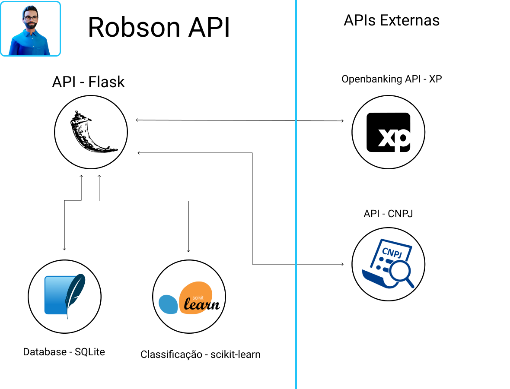

# Robson API : o seu Banker Digital

  

<h3 align="center">Bem vindo ao Robson API!</h3>
   

---

Conteúdo 

1. [Introdução](#introdução)
1. [O Problema](#o-problema)
1. [Oportunidade de Mercado](#oportunidade-de-mercado)
1. [Nossa Solução](#nossa-solução)
1. [Autores](#autores)
1. [License](#license)

---

## Introdução
O Robson é um app desenvolvido para o Hackathon XP - Open Finance com o objetivo de fornecer consultorias de investimento personalizadas a qualquer investidor, através do uso de inteligência artificial aplicada à carteira consolidada do cliente via open finance.

O app oferece uma visualização consolidada da carteira do cliente, independentemente da instituição financeira onde investe, e vai fazendo sugestões de rebalanceamento de carteira para otimizar a performance dos investimentos.

---

## O Problema
O Brasil ainda tem uma porcentagem pequena da população que investe no setor financeiro

E daqueles que investem, a grande maioria ainda não tem os conhecimentos adequados para fazer uma gestão apropriada de seus investimentos.

Segundo o último Raio X do Investidor Brasileiro 2021, realizado pela ANBIMA, dos brasileiros que investem: 
- 29% ainda investe na poupança
- 55% busca informações de investimento com amigos e parentes
- 61% não sabe o principal fator na escolha do investimento realizado.

## Oportunidade de Mercado
Acreditamos que o Open Finance permitirá uma redemocratização no acesso a serviços financeiros de qualidade, pelo qual decidimos criar o Robson.

Através da agregação de contas, nosso algoritmo conseguirá realizar sugestões de investimento mais aderentes ao perfil do investidor, replicando o trabalho que um consultor de valores mobiliários faria com a carteira de pessoas de alta renda.

Assim qualquer pessoa conseguirá ter uma melhor segurança na sua gestão dos seus investimentos.

## Nossa Solução

Usamos a inteligencia artificial para segregar os usuarios em grupos, para podermos oferecer investimentos  objetivos e comum entre eles
e oferecer para novos usuarios com o mesmo perfil do grupo.

### Arquitetura

### End Points
#### Usuario

> ####  [GET] => <tt> /user/<string:user_id> </tt>
> > *Pega usuarios no banco de dados*

> ####  [GET] => <tt> /user/<string:user_id>/allocation </tt>
> > *Pega alocação de investimentos do usuario*

> ####  [GET] => <tt> /user/<string:user_id>/recommended_allocation </tt>
> > *Pega alocação recomendado de investimentos seguindo o perfil do usuario*

#### Objetivos

> ####  [POST] => <tt> /objective/create </tt>
> > *Cria um novo objetivo*

#### Inteligencia artificial

> ####  [GET] => <tt> /ai/cluster/ </tt>
> > *Lista usuarios separados em clusters de acordo com suas transaçoes PIX.
> Confira [Clusterização](#clusterização) para mais detalhes*

### Clusterização

A clusterização é um metodo de classificação de dados que separar e categorizar em grupos.
Usamos a clusterização para segregar os usuarios em grupos permitindo criar previsoes de seus objetivos de vida,
assim podendo oferece-lo sugestoes de investimentos personalizadas de acordo com o momento atual de sua vida.

Pegamos os CNPJ de cada transação feita pelo usuario,
usando o historico de pix provido pela api da xp.
A api da XP nos devolve apenas CPF,
porém assumimos que com open finance esse dado estaria disponivel com a devida permisão do usuario.

Com o CNPJ em mãos acessamos uma API publica para capturar as descriçoes dos CNAE e os CNAES secundarios
e usamos para cruazer e criar grupos com consumo parecido.
Assim podendo propor um objetivo que seja comum ao grupo.

### Tecnologias Implementadas    

- Python
- Flask
- SQLite
- Open Banking XP API
- Scikit learn

---

## Autores

* [Lucas Martins](https://github.com/lucaomartins/)
* [Bruno Teixeira](https://github.com/brunotsantos1997)
* [Christian Rojas](https://www.linkedin.com/in/christianr1/)
* [Giovanni Postiglione](https://www.linkedin.com/in/giovannisaboya/)
* [Gisele SPrata](https://www.linkedin.com/in/gisprata/)
